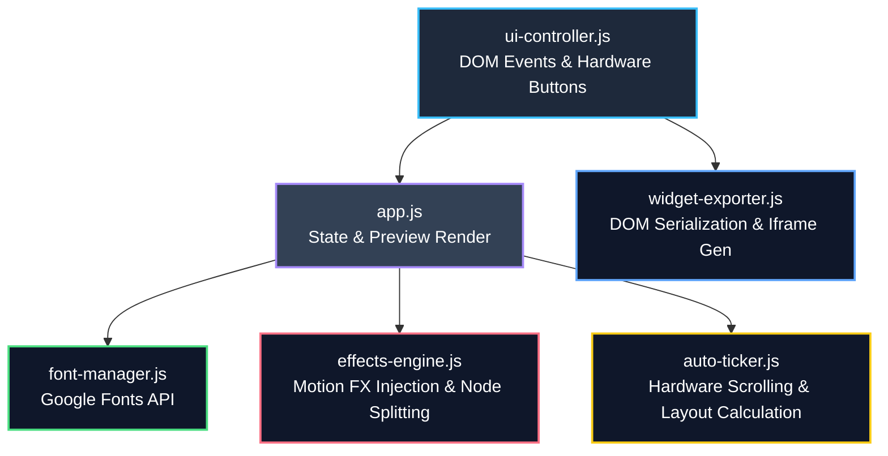

<div align="center">

# 🎨 FontForge Studio OS
### The Ultimate Skeuomorphic Interactive Text Engine

[](LICENSE)
[](https://ketineniramarao.github.io/Font-Forge/)
[](CHANGELOG.md)

<div style="display: flex; justify-content: center; gap: 10px; margin: 15px 0;">
  
  
  
</div>

[Live Demo](https://ketineniramarao.github.io/Font-Forge/) · [Report Bug](https://github.com/KetineniRamarao/Font-Forge/issues) · [Request Feature](https://github.com/KetineniRamarao/Font-Forge/issues)

</div>

---

## 🌟 Overview
**FontForge Studio OS** is a hyper-polished, zero-dependency Vanilla JavaScript and CSS playground for generating complex, 2.5D interactive text widgets. We built this from the ground up to push the boundaries of what is possible in the browser without relying on heavy frameworks, WebGL, or Canvas. The result is a blazing fast, highly embeddable, GPU-accelerated motion text engine wrapped in a beautifully tactile skeuomorphic hardware console interface.

## ✨ Core Engineering Features

### 🎛️ Photorealistic Skeuomorphic Design System
- **Physical Tactility**: The entire UI is built to mimic high-end hardware. Buttons feature deep bevels, inner highlights, and authentic depressed states (`:active`).
- **CSS Variable Mapping**: We dynamically map global design tokens to the hardware console. This allows the entire UI to instantly transform without page reloads.
- **Brand Marquee**: A dynamically colored, infinite-scrolling LCD ticker embedded into the bottom bezel of the console that inherits neon borders and glows based on the active chassis theme.

### 🚀 Advanced Motion & Physics Engines
- **Digital Decay Engine**: We engineered a proprietary `character-split` algorithm. Instead of relying on CSS pseudo-elements (which break scroll wrappers), the text is fractured into individual `<span class="char">` nodes. This allows for complex, staggered animations like `Glitch`, `Crystal Shatter`, and `Gravity Drop`.
- **Auto-Ticker Engine (`auto-ticker.js`)**: A custom-built JavaScript physics engine that calculates string overflow widths and smoothly loops text at 60fps utilizing hardware-accelerated `transform: translateX()`. It includes manual hardware speed overrides (`+` / `-`).

### 🎨 8 Curated Aesthetic Themes
The hardware chassis completely transforms into 8 distinct paradigms:
1. **Glassmorphic** — Frosted glass with soft highlights and background blur.
2. **Neon Cyberpunk** — Synthwave aesthetic with hot pink/cyan borders and heavy neon text shadows.
3. **Brutalist** — Raw, high-contrast, bold blocks with zero border-radius.
4. **Luxury Gold** — Premium metallic gradients and deep amber screen bezels.
5. **Retro Terminal** — CRT green phosphor glow with subtle scanlines.
6. **Minimal Clean** — Unobtrusive, Apple-esque frosted UI.
7. **Soft Pastel** — Dreamy, gentle color palettes.
8. **Dark Monochrome** — Elegant, pure dark-mode minimalism.

### 🔤 Dynamic Typography & Color Engine
- **Font-Manager (`font-manager.js`)**: Intercepts the Google Fonts API to dynamically load 16+ typefaces at runtime, categorizing them via a highly responsive filtering system (Serif, Sans-Serif, Display).
- **Color Overrides**: Precision CSS color wheels that bypass the central theme defaults, allowing users to inject custom Hex codes directly into the Screen Background and Text layers.

### 📢 I/O Export Architecture
- **Widget Exporter (`widget-exporter.js`)**: Real-time DOM serialization. It scrapes the exact CSS variables and DOM states from your current configuration and compiles them into a standalone payload.
- **Iframe Embeds**: Generates highly isolated `<iframe>` URLs completely separated from the main UI, meaning you can drop the widget into Notion, Webflow, or WordPress with zero CSS conflicts.
- **Clipboard Fallbacks**: Uses modern `navigator.clipboard` APIs with a bulletproof `window.prompt` fallback to ensure copy-pasting code works flawlessly across local HTTP and secure HTTPS environments.

---

## 🏗️ Technical Architecture

FontForge Studio operates on a robust ES6 Module architecture. 



## 📁 File Structure

```text
fontforge-studio/
├── index.html           # Main Hardware Console App
├── widget.html          # Lightweight Iframe Target for Embeds
├── README.md            # You are here
├── js/
│   ├── app.js           # Core State Manager
│   ├── ui-controller.js # Button & Input Bindings
│   ├── font-manager.js  # Dynamic Typography
│   ├── effects-engine.js# CSS/SVG Effect Injector
│   ├── auto-ticker.js   # Infinity Scroll Physics
│   └── widget-exporter.js # I/O Output Generator
└── css/
    ├── base.css         # Reset & Typography Base
    ├── variables.css    # Global Design Tokens
    ├── components.css   # Inputs, Buttons, Tags
    ├── widget-3d.css    # The Skeuomorphic Hardware Console
    ├── themes.css       # 8 Distinct Skin Overrides
    └── effects.css      # The 12 Motion FX Keyframes
```

## 🚀 Quick Start

Because FontForge Studio relies on pure web fundamentals, there are absolutely no build steps, node_modules, or package managers required.

### Self-Hosting
```bash
git clone https://github.com/KetineniRamarao/Font-Forge.git
cd Font-Forge
```
Simply open `index.html` in your browser. *(Note: To test the Export clipboard functions locally, serve over a basic HTTP server like VSCode Live Server due to browser security policies).*

## 📖 Using the Exporter

1. **EJECT / EMBED**: Instantly generates an `<iframe>` snippet pointing dynamically to the hosted `widget.html` payload.
2. **SAVE HTML**: Serializes the current DOM state and downloads a fully isolated, standalone `.html` file containing your exact widget with baked-in CSS.

## 📜 License
Distributed under the MIT License. See `LICENSE` for more information.
